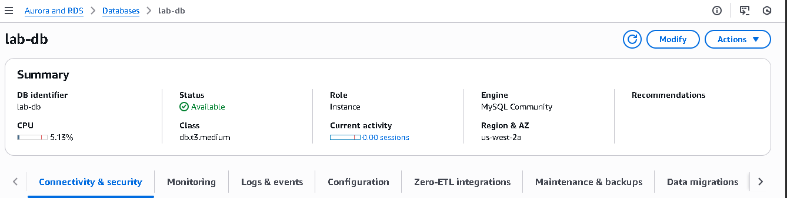
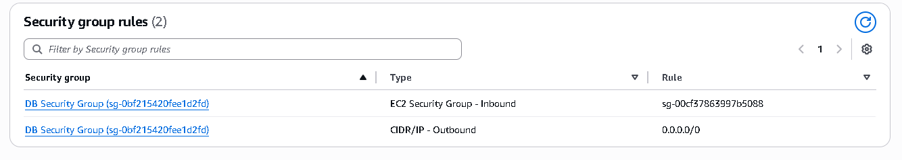
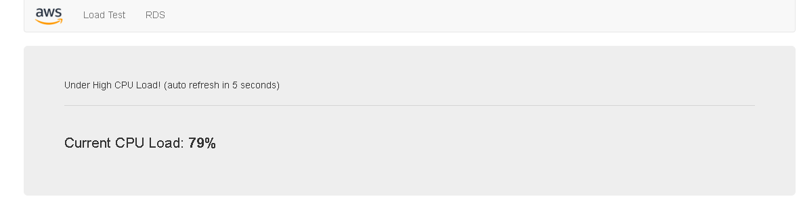
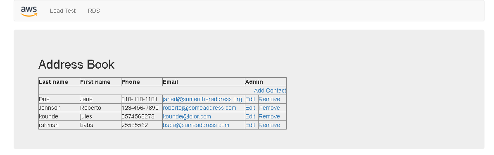

# Building and Connecting an Amazon RDS Database

I completed a hands-on lab where I:
- Launched an **Amazon RDS DB instance with Multi-AZ (high availability)**
- Configured **security groups** to securely connect my web server to the database
- Tested the setup with a **successful DB connection**
- Integrated the DB into a **web application** and performed CRUD operations

## Screenshots
  
*RDS Dashboard showing Multi-AZ instance*

  
*Security Group inbound rules allowing web server access*

  
*Successful DB connection test via client/CLI*

  
*Web app displaying data retrieved from RDS*

## What I did (short steps)
1. Launched RDS instance (Multi-AZ) in AWS RDS.
2. Created/updated security group to allow the web server’s IP/port.
3. Tested DB connectivity with a client (e.g., MySQL Workbench / psql).
4. Configured the web app connection string (using env var).
5. Performed CREATE/READ/UPDATE/DELETE operations through the app.

